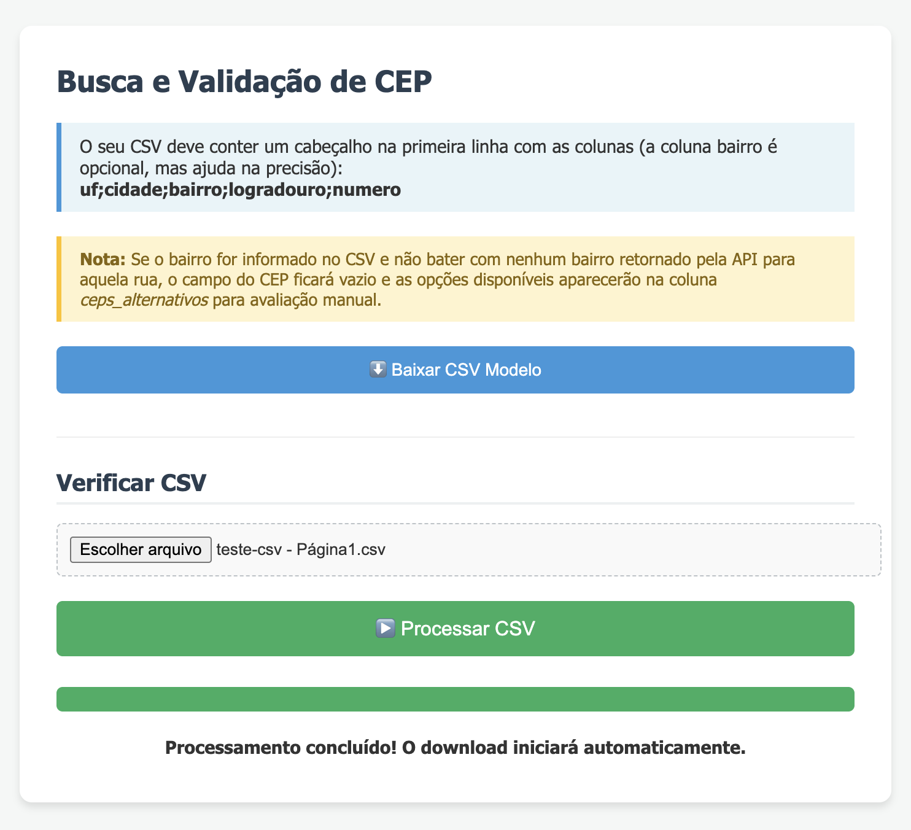

# Buscador de CEP em Lote (ViaCEP)

Uma ferramenta de página única (SPA) simples e eficiente para buscar e validar CEPs em lote a partir de um arquivo CSV. Todo o processamento é feito no lado do cliente (no seu navegador), consumindo a API pública e gratuita do [ViaCEP](https://viacep.com.br/).

🌍 **Live Demo:** [Acessar a página da ferramenta](https://luisleao.github.io/encontre-cep-por-csv/index.html)



## 🚀 Funcionalidades

* **Processamento Local:** Os dados do seu CSV não são enviados para nenhum banco de dados ou servidor backend. O navegador faz as requisições diretamente para a API do ViaCEP.
* **Busca Inteligente por Bairro:** Se o bairro for informado na planilha, o script procura a correspondência exata para evitar que você pegue o CEP do outro lado da cidade em avenidas longas.
* **Validação Dupla:** Primeiro o script busca o CEP pelo nome da rua. Depois, faz uma busca reversa usando o CEP encontrado para trazer regras de numeração (lado par, lado ímpar, limite de numeração).
* **Prevenção de Bloqueio (Anti-DDoS):** Implementado um *delay* de 1 segundo por linha processada/requisição para respeitar os limites de uso gratuito da API do ViaCEP e evitar o bloqueio do seu IP.
* **Sugestão de CEPs:** Caso o bairro preenchido no CSV não bata com os retornos da API para aquela rua, o script não tenta "chutar" o CEP e deixa a célula em branco, preenchendo uma coluna extra com todas as opções de CEPs da rua para validação manual do usuário.

## 📋 Como Usar

1. Acesse a [página da ferramenta](https://luisleao.github.io/encontre-cep-por-csv/index.html) ou baixe o arquivo `index.html` e abra em seu navegador.
2. Prepare o seu arquivo `.csv` (veja o formato abaixo). Se tiver dúvidas, você pode clicar no botão **"Baixar CSV Modelo"** na própria página.
3. Clique em "Escolher arquivo", selecione o seu `.csv` e em seguida clique em **"Processar CSV"**.
4. Aguarde a barra de progresso ser concluída. O download do novo arquivo com os resultados começará automaticamente.

## 📄 Formato do CSV

O arquivo deve conter um cabeçalho na primeira linha. A ferramenta aceita arquivos separados por vírgula (`,`) ou ponto e vírgula (`;`).

**Colunas obrigatórias:**
* `uf`: Sigla do estado com 2 letras (ex: SP, RJ, MG).
* `cidade`: Nome exato da cidade.
* `logradouro`: Nome da rua, avenida, travessa, etc. (mínimo de 3 caracteres. Evite colocar o número junto ao nome).

**Colunas opcionais:**
* `bairro`: Fortemente recomendado preencher. Aumenta a precisão da busca em ruas que cruzam múltiplos bairros.
* `numero`: O número da residência. A API não usa o número para buscar, mas ele é mantido no arquivo final para você não perder a referência.

**Exemplo de CSV válido:**
```csv
uf;cidade;bairro;logradouro;numero
SP;São Paulo;Bela Vista;Avenida Paulista;1000
RJ;Rio de Janeiro;Centro;Avenida Rio Branco;156
MG;Belo Horizonte;;Avenida Afonso Pena;500